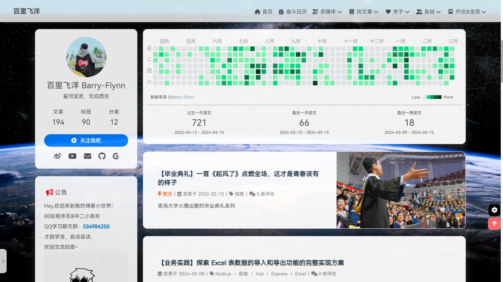

# hexo-github-calendar

本插件用于在 Hexo 中显示 GitHub 贡献度热力图



## 安装依赖

```sh
npm i @barry-flynn/hexo-github-calendar
```

## 添加配置

在 Hexo 项目根目录的 `_config.yml` 文件最后面添加如下配置（注意是在 Hexo 的配置文件中添加，而不是主题的配置文件），以我所使用的 Butterfly 主题为例，需要添加的内容为：

```yml
# hexo-github-canlendar
# 贡献度热力图插件 https://github.com/Barry-Flynn/hexo-github-calendar
githubcalendar:
  enable: true        # 是否启用本插件
  enable_page: /      # 要生效的页面，如 / 首页，/about/ 介绍页等
  user: Barry-Flynn   # GitHub 用户名
  layout:
    type: id
    name: recent-posts
    index: 0
  githubcalendar_html: '<div class="recent-post-item" style="width:100%;height:auto;padding:10px;"><div id="github_loading" style="width:10%;height:100%;margin:0 auto;display: block"><svg xmlns="http://www.w3.org/2000/svg" xmlns:xlink="http://www.w3.org/1999/xlink"  viewBox="0 0 50 50" style="enable-background:new 0 0 50 50" xml:space="preserve"><path fill="#d0d0d0" d="M25.251,6.461c-10.318,0-18.683,8.365-18.683,18.683h4.068c0-8.071,6.543-14.615,14.615-14.615V6.461z" transform="rotate(275.098 25 25)"><animateTransform attributeType="xml" attributeName="transform" type="rotate" from="0 25 25" to="360 25 25" dur="0.6s" repeatCount="indefinite"></animateTransform></path></svg></div><div id="github_container"></div></div>'
  pc_minheight: 280px
  mobile_minheight: 0px
  # 贡献统计的梯度色卡值，可自行调整
  color: "['#ebedf0', '#a2f7af', '#6ce480', '#54ad63', '#469252', '#31753c', '#1f5f2a', '#13531f', '#084111', '#032b09', '#000000']"
  # 推荐填写你自建的API接口，方法详见本插件配套Python后端 https://github.com/Barry-Flynn/python_github_calendar_api
  api: https://github-calendar-api.meta-code.top/api
  calendar_js: https://cdn.jsdelivr.net/gh/barry-flynn/hexo-github-calendar/hexo_githubcalendar.js
  plus_style: ""
```

## 本地预览

```sh
hexo clean & hexo g & hexo s
```

## 说明与鸣谢

本项目 fork 自仓库 [Zfour/hexo-github-calendar](https://github.com/Zfour/hexo-github-calendar)，对应的原 npm 依赖包是 [hexo-githubcalendar](https://www.npmjs.com/package/hexo-githubcalendar)，所匹配的原 Python 后端接口是 [Zfour/python_github_calendar_api](https://github.com/Zfour/python_github_calendar_api)，原来的传参方式是直接在 API 接口后面拼接用户名 `/api?Barry-Flynn`，不符合 key-value 形式的标准规范，因此我对前后端都进行了改进。

本项目 [Barry-Flynn/hexo-github-calendar](https://github.com/Barry-Flynn/hexo-github-calendar) 为改进后的 Hexo 前端插件，对应的 npm 依赖包是 [@barry-flynn/hexo-github-calendar](https://www.npmjs.com/package/@barry-flynn/hexo-github-calendar)，新的后端 Python 接口是 [Barry-Flynn/python_github_calendar_api](https://github.com/Barry-Flynn/python_github_calendar_api)，其现在的传参方式为 `/api?user=Barry-Flynn`

## 从旧版本迁移

如果需要从旧依赖包迁移至本项目对应的新依赖包，请先卸载旧依赖：

```sh
npm uninstall hexo-githubcalendar
```

再安装本项目所对应的新依赖：

```sh
npm i @barry-flynn/hexo-github-calendar
```

并按照本文档调整根目录的 `_config.yml` 配置项即可，其中主题为 Butterfly、Volantis、Matery、MengD 的同学，可以查看 [_config.yml](./_config.yml) 文件中的模板，其他主题的同学请自行修改挂载元素配置项 `githubcalendar_html` 进行适配。

为了服务稳定性，推荐根据 [Barry-Flynn/python_github_calendar_api](https://github.com/Barry-Flynn/python_github_calendar_api) 自己在 Vercel 或私有服务器自建 API 后端，本文档中提供的 api 地址可能承载不了大家的过量请求，会随时更换从而失效。
